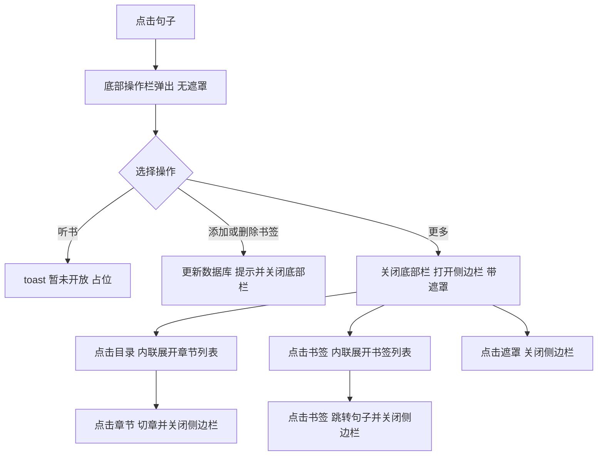

# 阅读页：句子底部操作栏 + 侧边栏目录/书签

## 概述

修改 [`pages/reader/reader.uvue`](pages/reader/reader.uvue)，为句子点击新增无遮罩底部操作栏，并完善左侧边栏的「目录」「书签」功能。涉及数据层（书签表）与 UI 层改动，遵循"代码精简、仅做最基本功能"原则。

## 交互流程



## 数据层改动

### 1. [`common/models.uts`](common/models.uts) 新增书签模型

```ts
// 书签（章节索引 + 句子索引 + 句子文本）
export class Bookmark {
	chapterIndex: number = 0
	sentenceIndex: number = 0
	sentence: string = ''
	constructor(chapterIndex: number, sentenceIndex: number, sentence: string) {
		this.chapterIndex = chapterIndex
		this.sentenceIndex = sentenceIndex
		this.sentence = sentence
	}
}
```

### 2. [`common/db.uts`](common/db.uts) 新增书签表与增删查函数

- 在 [`getDb()`](common/db.uts:7) 中新增建表语句：

```sql
CREATE TABLE IF NOT EXISTS bookmarks (id INTEGER PRIMARY KEY AUTOINCREMENT, bookId INTEGER, chapterIndex INTEGER, sentenceIndex INTEGER, sentence TEXT)
```

- 新增函数（复用现有 `getDb()` 写法，按 id 排序即添加顺序）：

| 函数 | 作用 |
| --- | --- |
| `addBookmark(bookId, chapterIndex, sentenceIndex, sentence)` | 插入书签 |
| `removeBookmark(bookId, chapterIndex, sentenceIndex)` | 按章节+句子删除该书签 |
| `getBookmarks(bookId): Bookmark[]` | 读取该书全部书签 |
| `isBookmarked(bookId, chapterIndex, sentenceIndex): boolean` | 判断当前句子是否已加书签 |

- 在 [`deleteBook()`](common/db.uts:128) 中追加 `DELETE FROM bookmarks WHERE bookId = ...` 级联清理。

## UI 层改动（reader.uvue）

### 模板

- **底部操作栏**（`bottomBarVisible` 控制，无遮罩）：

```
听书（占位）  添加书签 / 删除书签（按状态切换）  更多
```

- **侧边栏**（保留原 5 项竖排菜单，目录/书签点击内联展开列表，其余 3 项占位无动作）：
  - 「目录」展开章节列表，当前章节高亮，点击切章
  - 「书签」展开书签列表（从 db 读取），空时显示"暂无书签"，点击跳转对应句子

### 脚本新增状态与方法

| 状态 | 说明 |
| --- | --- |
| `bottomBarVisible` | 底部栏是否可见 |
| `bookmarked` | 当前句子是否已加书签（控制按钮文案） |
| `sidebarExpanded` | 侧边栏展开项：`''` / `catalog` / `bookmark` |
| `bookmarks` | 书签列表 |
| `bookmarkKeys` | 该书全部已书签句子 key 数组（格式 `章节索引_句子索引`），用于正文下划线标识 |

| 方法 | 说明 |
| --- | --- |
| [`onSentenceClick()`](pages/reader/reader.uvue:72) | 高亮 + 解析当前句子章节/句子索引 + 刷新 `bookmarked` + 弹出底部栏 |
| `toggleBookmark()` | 已加则删、未加则加，toast 提示后关闭底部栏；同步更新 `bookmarkKeys` |
| `onListen()` | 听书占位，toast「暂未开放」 |
| `openSidebar()` | 关闭底部栏、加载书签列表与 `bookmarkKeys`、打开带遮罩侧边栏 |
| `loadBookmarkKeys()` | 调用 `getBookmarks` 生成 `bookmarkKeys` 数组 |
| `toggleSidebarExpand(key)` | 目录/书签展开切换（点击当前项收起，点击其它项切换） |
| 目录项点击 | 复用 [`switchChapter()`](pages/reader/reader.uvue:215) 切章并关闭侧边栏 |
| 书签项点击 | 复用 [`loadChapter(index, restoreSentence)`](pages/reader/reader.uvue:184) 定位句子，并设置高亮、关闭侧边栏 |
| [`closeSidebar()`](pages/reader/reader.uvue:77) | 点击遮罩关闭侧边栏 |
| [`sentenceClass()`](pages/reader/reader.uvue:67) | 扩展：命中 `bookmarkKeys` 时追加 `bookmarked` 类（下划线） |

### 样式（SCSS）

- `.bottom-bar`：`position: fixed` 底部、行布局三按钮、白底、上边框；**不渲染遮罩**，z-index 高于 `.footer`、低于 `.mask`(100)
- `.sidebar` 新增展开区样式：菜单项 + 下方可滚动列表区（章节/书签列表）
- 复用现有 `.mask` 遮罩

## 关键设计决策

1. **书签唯一性**：同一（章节, 句子）最多一个书签，按钮按 `bookmarked` 在「添加书签/删除书签」间切换
2. **底部栏无遮罩**：弹出时不遮挡正文，无半透明遮罩、点击空白不自动关闭；通过执行操作（书签/更多）或听书占位自然退出
3. **侧边栏遮罩**：保留现有 `.mask`，点击遮罩关闭
4. **听书占位**：仅 toast 提示，不实现任何功能
5. **书签下划线**：`onLoad` 时即加载 `bookmarkKeys`，正文中已加书签的句子通过 `sentenceClass` 追加 `bookmarked` 类显示下划线；`toggleBookmark` / `openSidebar` 时同步刷新
6. **多书隔离**：书签表带 `bookId` 字段，增删查均按 `bookId` 过滤，删除严格按 `(bookId, chapterIndex, sentenceIndex)` 定位；`bookmarkKeys` 与书签列表均在 `onLoad` 时按当前 `bookId` 加载，换书不串
