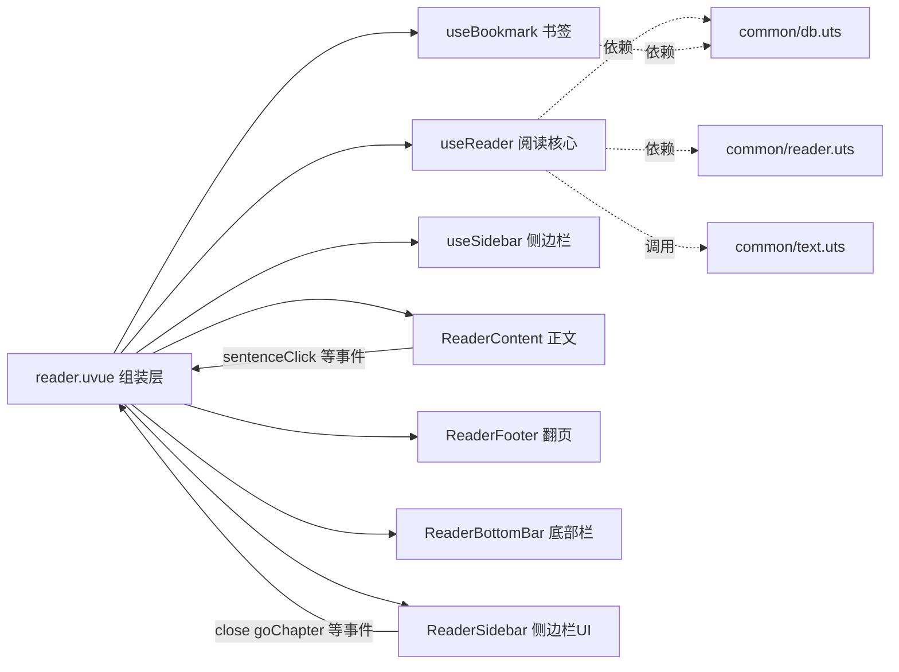

# 阅读页模块化拆分计划

## 概述

将 [`pages/reader/reader.uvue`](pages/reader/reader.uvue)（当前 523 行，模板 + 约 270 行脚本 + 约 180 行 SCSS 混于一体）按方案 C 全拆为：**UI 子组件 + 组合式逻辑 + 纯函数**。目标：页面只剩组装层（薄），各模块职责单一、可独立维护。不改变任何现有功能与交互。

## 目标文件结构

```
common/
  text.uts                      [新增] 文本纯函数：formatContent / parseSentence / sentenceClass
composables/
  useReader.uts                 [新增] 阅读核心逻辑：章节加载 / 进度保存
  useBookmark.uts               [新增] 书签逻辑：高亮 / 增删 / 列表
  useSidebar.uts                [新增] 侧边栏逻辑：开关 / 展开项
components/reader/
  ReaderContent.uvue            [新增] 章节正文：渲染 + 句子偏移测量 + 滚动反推
  ReaderFooter.uvue             [新增] 底部翻页
  ReaderBottomBar.uvue          [新增] 底部操作栏（听书/书签/更多）
  ReaderSidebar.uvue            [新增] 侧边栏 + 遮罩 + 目录/书签列表
pages/reader/
  reader.uvue                   [改写] 仅保留组装层
```

## 架构图



## 各模块职责与接口

### 1. [`common/text.uts`](common/text.uts)（纯函数，新增）

从 `reader.uvue` 原脚本原样迁移，去掉对外部状态依赖：

| 函数 | 来源 | 说明 |
| --- | --- | --- |
| `formatContent(text: string, title: string): string[]` | 原 [`formatContent()`](pages/reader/reader.uvue:171) | 按句号/问号/感叹号切分（引号内不切分）；`title` 由调用方传入，不再读取 `chapters`/`currentIndex` |
| `parseSentence(key: string): number[]` | 原 [`parseSentence()`](pages/reader/reader.uvue:112) | 解析 `章节_句子` key |
| `sentenceClass(activeSentence: string, bookmarkKeys: string[], toSentence: string): string` | 原 [`sentenceClass()`](pages/reader/reader.uvue:103) | 计算 active/bookmarked 样式类，入参化 |

### 2. [`composables/useReader.uts`](composables/useReader.uts)（阅读核心，新增）

负责：章节状态、章节加载（后台线程读文件+解码）、章节切换、滚动进度保存。

- **状态**：`chapters`、`currentIndex`、`content`、`encoding`、`scrollIntoViewId`、内部 `filePath`/`bookId`/`lastSentence`/`saveTimer`
- **方法**：
  - `init(bookId: number)`：加载书籍信息、章节、书签 key、上次进度
  - `loadChapter(index: number, restoreSentence: number)`：后台读章 + `formatContent` + 设置 `scrollIntoViewId`
  - `switchChapter(idx)` / `prevChapter()` / `nextChapter()`
  - `onScrollTop(idx: number)`：防抖保存进度（由正文组件反推顶部句子后回调）
  - `saveProgress()`：退出时保存
- **注意**：组合式函数不内嵌页面生命周期，暴露 `init` / `saveProgress`，由页面 `onLoad` / `onUnload` 调用，规避 `onLoad` 在非页面 `.uts` 中的可用性问题
- 从 `@dcloudio/uni-app` 显式导入所需 API；`ref` 在 `.uts` 中需确认导入方式（方案落地时以 HBuilderX 编译为准）

### 3. [`composables/useBookmark.uts`](composables/useBookmark.uts)（书签，新增）

负责：当前高亮句子、书签状态、书签增删查。

- **状态**：`activeSentence`、`bookmarked`、`bookmarks`、`bookmarkKeys`
- **方法**：
  - `init(bookId: number, getContent: () => string[])`：初始化（注入 `bookId` 与取句子文本的回调）
  - `loadKeys()`：加载该书全部书签 key
  - `onSentenceClick(toSentence: string)`：高亮切换 + 刷新 `bookmarked`
  - `toggleBookmark()`：增删书签 + toast + 更新 `bookmarkKeys`
  - `refresh()`：重新加载 `bookmarks`（侧边栏打开时）
  - `highlight(chapterIndex: number, sentenceIndex: number)`：书签跳转时设置高亮

### 4. [`composables/useSidebar.uts`](composables/useSidebar.uts)（侧边栏逻辑，新增）

- **状态**：`visible`、`expanded`（`'' | 'catalog' | 'bookmark'`）、`items`（含 目录/书签/情感推理/设置）
- **方法**：`open()`（重置 expanded + 置 visible）、`close()`、`onItemClick(value)`（切换展开项）

### 5. [`components/reader/ReaderContent.uvue`](components/reader/ReaderContent.uvue)（正文，新增）

渲染章节标题 + 句子列表 + 空状态；**内部完成句子偏移测量与滚动反推**（因 `.sentence` 节点位于组件内，`uni.createSelectorQuery` 需在组件作用域内执行，故不留在页面）。

- **props**：`chapters`、`currentIndex`、`content`、`activeSentence`、`bookmarkKeys`、`scrollIntoViewId`
- **emits**：`sentenceClick(toSentence)`、`scrollTop(idx)`（反推的顶部句子索引）
- **内部**：`watch(content)` 后 `nextTick` 测量 `sentenceOffsets`；`scroll-view` 的 `@scroll` 反推顶部句子并 emit `scrollTop`；`sentenceClass` 调用 [`common/text.uts`](common/text.uts)
- 将原 `.content-wrap`/`.chapter`/`.sentence` 相关样式迁移至此

### 6. [`components/reader/ReaderFooter.uvue`](components/reader/ReaderFooter.uvue)（翻页，新增）

- **props**：`visible`、`currentIndex`、`total`
- **emits**：`prev`、`next`
- 迁移 `.footer` 样式

### 7. [`components/reader/ReaderBottomBar.uvue`](components/reader/ReaderBottomBar.uvue)（底部操作栏，新增）

- **props**：`visible`、`bookmarked`
- **emits**：`listen`、`toggleBookmark`、`more`
- 迁移 `.bottom-bar` 样式

### 8. [`components/reader/ReaderSidebar.uvue`](components/reader/ReaderSidebar.uvue)（侧边栏 UI，新增）

- **props**：`visible`、`items`、`expanded`、`chapters`、`bookmarks`、`currentIndex`
- **emits**：`close`（遮罩/返回）、`itemClick(value)`、`goChapter(index)`、`goBookmark(bm)`
- 内含遮罩 `.mask` + 侧边栏 + 目录/书签展开列表 + 空状态；迁移 `.mask`/`.sidebar` 相关样式

### 9. [`pages/reader/reader.uvue`](pages/reader/reader.uvue)（组装层，改写）

- 组合 `useReader` / `useBookmark` / `useSidebar`
- 模板仅保留组件标签 + `.page` 容器
- 生命周期：`onLoad` 调 `reader.init` + `bookmark.init` + `bookmark.loadKeys`；`onUnload` 调 `reader.saveProgress`
- 事件桥接：`goChapter` 调 `reader.switchChapter` + `sidebar.close`；`goBookmark` 调 `reader.loadChapter` + `bookmark.highlight` + `sidebar.close`
- 页面样式仅保留 `.page`

## 实施步骤（供 code 模式执行）

1. 新建 [`common/text.uts`](common/text.uts)：迁移 3 个纯函数并参数化
2. 新建 [`composables/useReader.uts`](composables/useReader.uts)：迁移章节加载/切换/进度逻辑
3. 新建 [`composables/useBookmark.uts`](composables/useBookmark.uts)：迁移书签逻辑
4. 新建 [`composables/useSidebar.uts`](composables/useSidebar.uts)：迁移侧边栏逻辑
5. 新建 [`components/reader/ReaderContent.uvue`](components/reader/ReaderContent.uvue)
6. 新建 [`components/reader/ReaderFooter.uvue`](components/reader/ReaderFooter.uvue)
7. 新建 [`components/reader/ReaderBottomBar.uvue`](components/reader/ReaderBottomBar.uvue)
8. 新建 [`components/reader/ReaderSidebar.uvue`](components/reader/ReaderSidebar.uvue)
9. 改写 [`pages/reader/reader.uvue`](pages/reader/reader.uvue) 为组装层
10. 验证编译与功能回归（章节加载、翻页、句子点击高亮、书签增删/跳转、侧边栏目录/书签、进度恢复）

## 注意事项 / 风险

- **UTS 导入**：`.uts` 模块中的 `ref`、`computed` 及 `@dcloudio/uni-app` API 导入方式以 HBuilderX 编译结果为准，若自动导入不可用则显式 `import`
- **选择器作用域**：`uni.createSelectorQuery` 测量 `.sentence` 偏移必须在 [`ReaderContent.uvue`](components/reader/ReaderContent.uvue) 组件内执行，避免跨组件查询
- **不改行为**：所有函数逻辑原样迁移，仅做入参化（如 `formatContent` 增加 `title` 参数），不新增任何功能
- **props/emits 命名**：uvue 中 props 使用 camelCase，模板绑定保持对应
- **空数组类型**：`defineProps` 中数组默认值需显式类型断言（如 `[] as Chapter[]`），规避已知编译问题
